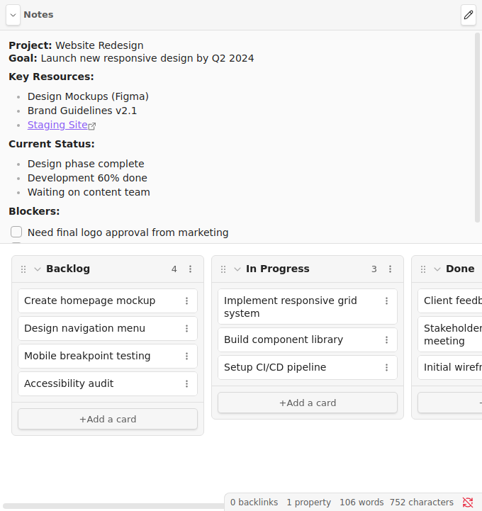
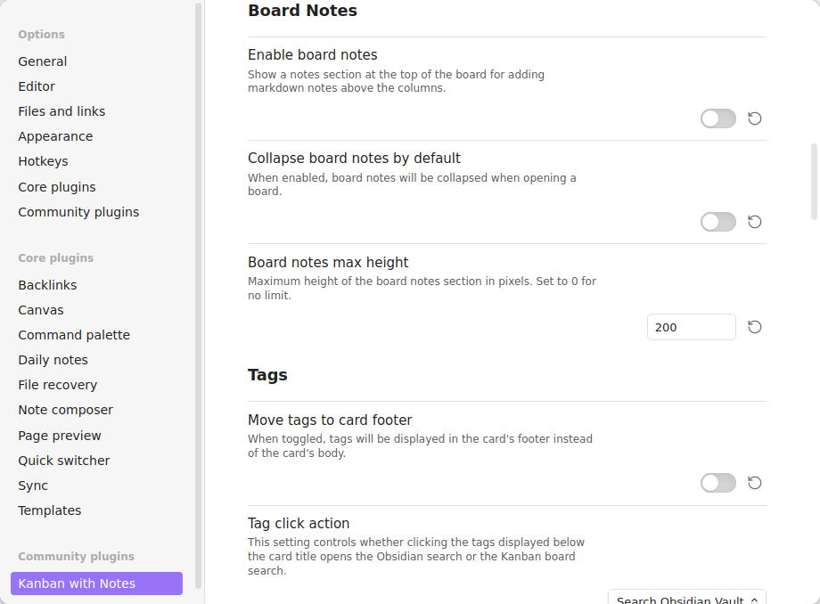

# Kanban with Notes

Enhanced fork of [obsidian-kanban](https://github.com/mgmeyers/obsidian-kanban) adding **inline board notes** for rich project context directly on your Kanban boards.

[](https://github.com/MALathon/obsidian-kanban-with-notes/actions)
[](https://opensource.org/licenses/MIT)

---

## Board Notes in Action


*Add project context, goals, checklists, and links directly above your Kanban columns*

---

## What's New

**Board Notes** - Add a dedicated notes section at the top of any Kanban board for:
- Project overviews and goals
- Quick reference links
- Master checklists (Tasks plugin compatible)
- Status updates and blockers

Content before the first `##` heading becomes your board notes:

```markdown
---
kanban-plugin: board
---

## Project: Website Redesign

**Goal:** Launch by Q2 2024
**Resources:** [[Design Docs]], [Staging](https://staging.com)

## Backlog
- [ ] Homepage mockup

## In Progress
- [ ] Responsive grid
```

**Features:**
- Inline editing (click edit or double-click)
- Collapsible with chevron button
- Configurable max-height
- Full markdown support
- Auto-excludes frontmatter

---

## Settings



Board notes are **disabled by default**. Enable via:
**Settings → Kanban with Notes → Board Notes**

| Setting | Default |
|---------|---------|
| Enable board notes | Off |
| Collapse by default | Off |
| Max height (px) | 200 |

---

## Installation

### Option 1: BRAT (Recommended)
1. Install [BRAT](https://github.com/TfTHacker/obsidian42-brat)
2. Add Beta Plugin: `MALathon/obsidian-kanban-with-notes`
3. Enable in Community Plugins

### Option 2: Manual
1. Download `main.js`, `manifest.json`, `styles.css` from [releases](https://github.com/MALathon/obsidian-kanban-with-notes/releases)
2. Place in `<vault>/.obsidian/plugins/kanban-with-notes/`
3. Enable in Settings

---

## Why a Separate Fork?

This fork exists independently rather than contributing back because:

- **Development approach** - Features developed iteratively with AI assistance ("vibe coding")
- **Experimental UX** - Board notes significantly changes the interface
- **Respectful forking** - Avoids merge friction with unsolicited PRs
- **Independent focus** - Prioritizes board notes quality and testing

Both projects can coexist serving different user needs.

---

## Testing & Quality

- **15 automated E2E tests** (all passing)
- **Real UI testing** with wdio-obsidian-service
- **CI/CD** via GitHub Actions on every commit

See [E2E-TESTING.md](E2E-TESTING.md) for details.

---

## Differences from Original

| Feature | Original | This Fork |
|---------|----------|-----------|
| Board notes section | No | Yes |
| Collapsible notes | No | Yes |
| Inline editing | No | Yes |
| Configurable height | No | Yes |
| E2E test suite | No | Yes |
| Core Kanban features | Yes | Yes |

---

## Credits

Fork of [obsidian-kanban](https://github.com/mgmeyers/obsidian-kanban) by [mgmeyers](https://github.com/mgmeyers).
All credit for core Kanban functionality goes to the original author.

**Support the original:**
[](https://github.com/sponsors/mgmeyers)

---

## License

MIT - See [LICENSE](LICENSE)

---

## Links

- [Original Plugin](https://github.com/mgmeyers/obsidian-kanban)
- [Report Issues](https://github.com/MALathon/obsidian-kanban-with-notes/issues)
- [Releases](https://github.com/MALathon/obsidian-kanban-with-notes/releases)
