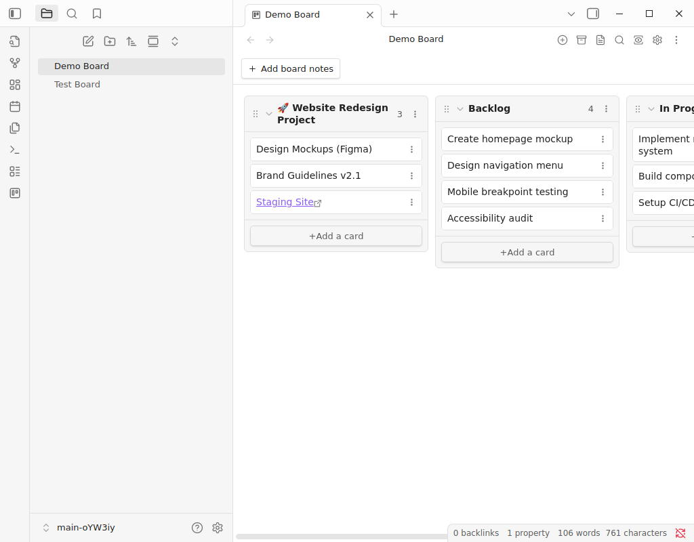

# Kanban with Notes

> **Enhanced fork** of [obsidian-kanban](https://github.com/mgmeyers/obsidian-kanban) adding **inline board notes** for rich project context directly on your Kanban boards.

[](https://github.com/MALathon/obsidian-kanban-with-notes/actions)
[](https://opensource.org/licenses/MIT)


*Board Notes feature showing project context above Kanban columns*

---

## ✨ What's New in This Fork

### 📝 **Board Notes** - The Game Changer

Add a **dedicated notes section** at the top of any Kanban board. Perfect for:

- 📋 **Project overviews** - Describe goals, scope, and objectives
- 📌 **Quick reference** - Important links, resources, or documentation
- ✅ **Master checklists** - Track project-level tasks (works with Tasks plugin)
- 📊 **Status updates** - Current blockers, decisions, or key metrics
- 🔗 **Related notes** - Links to project documentation or meeting notes

### 🎯 Why Board Notes?

Traditional Kanban boards are great for tracking tasks, but lack space for **project context**. Board Notes solves this by letting you keep everything in one place:

```markdown
---
kanban-plugin: board
---

## 🚀 Project: Website Redesign

**Goal:** Launch new responsive design by Q2 2024

**Key Resources:**
- [[Design Mockups]]
- [[Brand Guidelines]]
- [Staging Site](https://staging.example.com)

**Blockers:**
- [ ] Waiting on final logo approval
- [ ] Need DevOps to provision staging server

**Metrics:** 15 tasks total, 8 completed (53%)

---

## Backlog

- [ ] Create homepage mockup
- [ ] Design navigation menu

## In Progress

- [ ] Implement responsive grid

## Done

- [x] Client feedback session
```

The content above the first `## Heading` becomes your board notes!

---

## 🎨 Features

<table>
<tr>
<td width="50%">

### Board Notes Features
- ✏️ **Inline editing** - Click edit button or double-click to edit
- 🔽 **Collapsible** - Click chevron to expand/collapse
- 📏 **Configurable height** - Set max-height or unlimited scrolling
- 🎨 **Full markdown** - Formatting, links, embeds, checklists
- 🔒 **Auto-excludes frontmatter** - Clean display without YAML
- ⚙️ **Optional** - Disabled by default, enable per your needs

</td>
<td width="50%">

### All Original Kanban Features
- ✅ Drag-and-drop cards between columns
- 📅 Date tracking and due dates
- 🏷️ Tags and metadata
- 🔍 Search and filtering
- 📱 Mobile support
- 🗂️ Archive completed items
- 📊 Multiple view modes (board/list/table)

</td>
</tr>
</table>

---

## ⚙️ Settings

Board notes are **disabled by default** to maintain compatibility. Enable via:
**Settings → Kanban with Notes → Board Notes → Enable board notes**

| Setting | Description | Default |
|---------|-------------|---------|
| **Enable board notes** | Show/hide the notes section | `Off` |
| **Collapse by default** | Start with notes collapsed | `Off` |
| **Max height** | Maximum height in pixels (0 = unlimited) | `200px` |

---

## 📦 Installation

### Option 1: BRAT (Beta Testing - Recommended)

1. Install [BRAT](https://github.com/TfTHacker/obsidian42-brat) from Community Plugins
2. Open **BRAT settings** → **Add Beta Plugin**
3. Enter: `MALathon/obsidian-kanban-with-notes`
4. Click **Add Plugin**
5. Enable **Kanban with Notes** in Community Plugins

### Option 2: Manual Installation

1. Download `main.js`, `manifest.json`, and `styles.css` from [latest release](https://github.com/MALathon/obsidian-kanban-with-notes/releases)
2. Create folder: `<vault>/.obsidian/plugins/kanban-with-notes/`
3. Copy files into the folder
4. Reload Obsidian
5. Enable plugin in **Settings → Community Plugins**

---

## 🧪 Quality & Testing

This fork includes comprehensive automated testing:

- ✅ **15 E2E tests** validating all board notes features
- ✅ **Automated CI/CD** via GitHub Actions
- ✅ **Real UI testing** using wdio-obsidian-service
- 🔄 Tests run on every commit and pull request

See [E2E-TESTING.md](E2E-TESTING.md) for details.

---

## 🔄 Differences from Original

| Feature | Original Kanban | This Fork |
|---------|----------------|-----------|
| Board notes section | ❌ | ✅ |
| Collapsible notes | ❌ | ✅ |
| Inline note editing | ❌ | ✅ |
| Configurable note height | ❌ | ✅ |
| Automated E2E testing | ❌ | ✅ |
| Core Kanban features | ✅ | ✅ (maintained) |

---

## 🤔 Why a Separate Fork?

This fork exists as an **independent project** rather than contributing back to the original for several reasons:

### Development Approach
- **Rapid prototyping**: Features were developed iteratively with AI assistance ("vibe coding")
- **Experimental nature**: Board notes significantly changes the UX and may not align with the original vision
- **Opinionated additions**: Some design decisions might not fit upstream maintainer preferences

### Maintenance Philosophy
- **Focus on board notes**: This fork prioritizes the board notes feature and its quality
- **Different testing approach**: Comprehensive E2E testing with wdio-obsidian-service
- **Independent release cycle**: Can iterate quickly without upstream approval process

### Respectful Forking
As a developer, I wanted to:
- ✅ Avoid creating merge friction with unsolicited large PRs
- ✅ Allow the original project to maintain its focused scope
- ✅ Give users who want board notes a stable option
- ✅ Properly credit and link to the original work

**Both projects can coexist!** Users who need board notes use this fork, while the original stays focused on its core strengths.

---

## 🙏 Credits

This plugin is a **fork** of [obsidian-kanban](https://github.com/mgmeyers/obsidian-kanban) by [mgmeyers](https://github.com/mgmeyers).

**All credit for the core Kanban functionality goes to the original author.**

### Support the Original Author

If you find the base Kanban features valuable, please consider supporting mgmeyers:

[](https://github.com/sponsors/mgmeyers)

---

## 🤝 Contributing

Contributions are welcome! This fork focuses on **board notes** and **quality improvements**.

For core Kanban features, consider contributing to the [original repository](https://github.com/mgmeyers/obsidian-kanban).

---

## 📄 License

MIT License - See [LICENSE](LICENSE) for details.

---

## 🔗 Links

- **Original Plugin:** [obsidian-kanban](https://github.com/mgmeyers/obsidian-kanban)
- **Issues:** [Report bugs or request features](https://github.com/MALathon/obsidian-kanban-with-notes/issues)
- **Releases:** [Download latest version](https://github.com/MALathon/obsidian-kanban-with-notes/releases)
